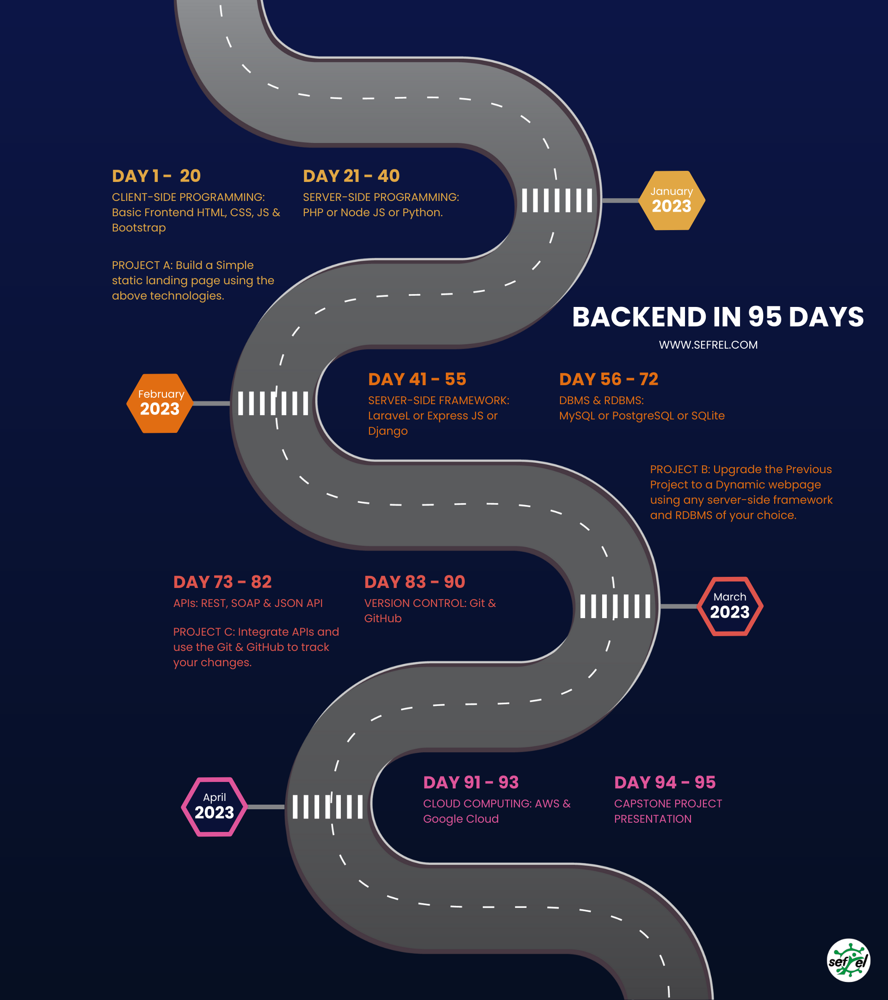

# Backend in 95 Days Challenge
The aim of this Challenge is to master backend programming in approximately 100 days (2023 1st Quarter) through reliable online resources and projects.

Below is the Challenge Roadmap:

Courtesy: SefRel Technologies
